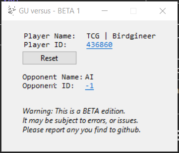

# GU versus
This is a simple application for checking the Gods Unchained debug log for you, and your opponents profile ids during a game. You can click on the profile ids to load up the respective GUdecks profile.

# Install

You can download the latest release from [here](https://github.com/TimothyMeadows/GUvrs/releases).

1. Install .NET 6.0 Runtime [x64](https://dotnet.microsoft.com/en-us/download/dotnet/thank-you/runtime-desktop-6.0.11-windows-x64-installer) | [x86](https://dotnet.microsoft.com/en-us/download/dotnet/thank-you/runtime-desktop-6.0.11-windows-x86-installer) (*Should not be needed for windows 10+*)
2. Extract the contents of the zip file into a location you wish to install the application.

# Usage

1. Run ```GUvrs.exe``` from the location you installed it.<br/>You can run the application before connecting to a game, while connecting to a game, or while already connected to a game.
2. You can click the reset button at any time and it will force the application to clear any ids it may have found, and schdule it to rescan for new ids as soon as it is able. It's best to do this once a game ends, and before starting the next game. Addtionally you can also close, and reopen the application for the same effect.

*Note: There will be a delay before a match is found once the application is started, or reset. This delay primarly depends on both your computers disk speed, and if any actions are being taken in game.*

# Known Issues

- This application, at this time, does not work in Casual Mode. Casual Mode does not write the needed (or any) log entries for player ids. This may change in the future.

# Screenshot

