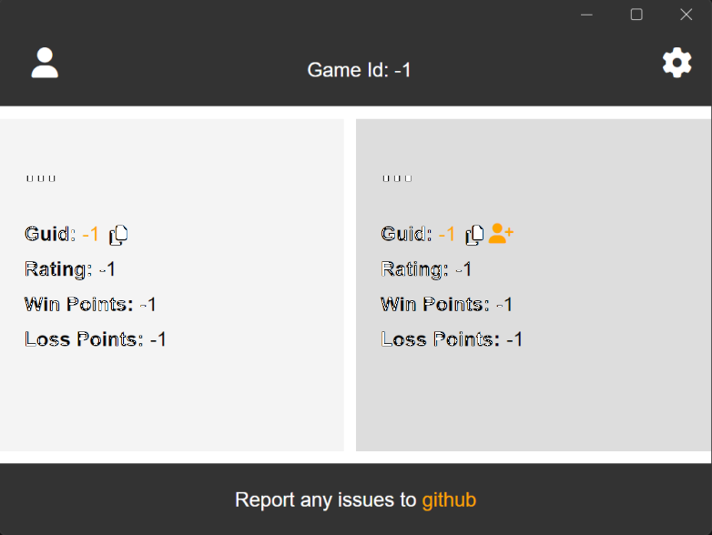

# GU versus 
This is a simple application for checking the Gods Unchained debug log for you, and your opponents profile ids during a game. You can click on the profile ids to load up the respective GUdecks profile.

# Screenshot

### Windows


### Mac


# Install

You can download the latest release for Windows, or Mac from [here](https://github.com/TimothyMeadows/GUvrs/releases).

## Windows

1. Extract the contents of the zip file into a location you wish to install the application.
2. Run the application ```GUvrs.exe``` in the folder you installed the application.
#### *Optional*
3. Right click on ```GUvrs.exe``` and select Send to -> Desktop to create a short cut on your desktop.

## Mac
1. You may get an error about the install package being from an unknown developer. You can bypass this:
    - Hold down control, click on the install package, then release control
    - Select open from the context menu
2. Open your application bar and search for ```GUvrs```
#### *Optional*
3. Right click on ```GUvrs``` whiile running and select Keep on Dock.

# Usage

1. Run ```GUvrs.exe``` from the location you installed it, or by launching the short cut you created. You can run the application before connecting to a game, while connecting to a game, or while already connected to a game.
2. You can click the reset button at any time and it will force the application to clear any ids it may have found. This will also schdule it to rescan for new ids as soon as it is able. It's best to do this once a game ends, and before starting the next game. Addtionally you can also close, and reopen the application for the same effect.

*Note: There may be a delay before player information is found. This delay primarly depends on both your computers disk speed, and if any actions have been taken in game that cause the game to write an entry to the log file.*

# Publish (Developers Only)

Visual Studio should automatically select the right publish commands for you, but in the instances it get's confused due to multi-targeting you can specify the publish command directly though the developer console.

### Windows
```bash
dotnet publish GUvrs.csproj -f net7.0-maccatalyst15.4
```

### Mac
```bash
dotnet publish GUvrs.csproj -f net7.0-windows10.0.19041.0
```
