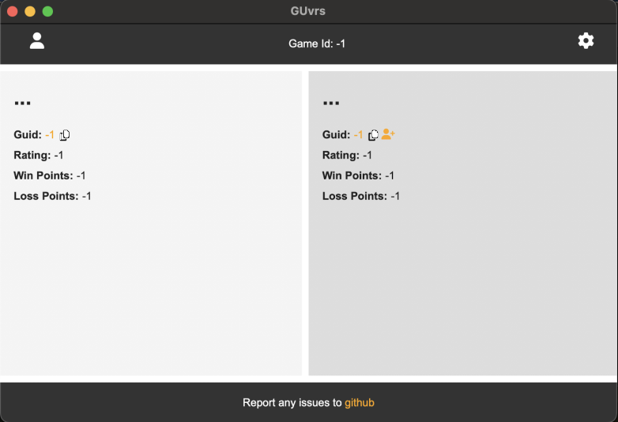

# GU versus 
This is a tool for checking the Gods Unchained debug log for you, and your opponents profile ids during a game. It will this display your profile information as well as win / loss points for you and your opponent. You can click on a guid to load up the respective GU decks profile, including the correct game mode you are both in.

# Screenshot

### Windows


### Mac


# Install

You can download the latest release for Windows, or Mac from [here](https://github.com/TimothyMeadows/GUvrs/releases/tag/2.0.2).

## Windows

1. Extract the contents of the zip file into a location you wish to install the application.
2. Run the application ```GUvrs.exe``` in the folder you installed the application.
#### *Optional*
3. Right click on ```GUvrs.exe``` and select Send to -> Desktop to create a short cut on your desktop.

## Mac
1. Extract the contents of the zip file into a location you wish to install the application.
2. Run the application ```GUvrs.app``` in the folder you installed the application.
    - You may get an error about the app being from an unknown developer. You can bypass this:
        - Hold down control, click on the app, then release control
        - Select open from the context menu
#### *Optional*
3. Right click on ```GUvrs``` whiile running and select Keep on Dock.

# Usage

1. Run ```GUvrs.exe``` or ```GUvrs.app``` from the location you installed it, or by launching the short cut you created. You can run the application before connecting to a game, while connecting to a game, or while already connected to a game.

*Note: There may be a delay before player information is found. This delay primarly depends on both your computers disk speed, and if any actions have been taken in game that cause the game to write an entry to the log file.*

# Publish (Developers Only)

Visual Studio should automatically select the right publish commands for you, but in the instances it get's confused due to multi-targeting you can specify the publish command directly though the developer console.

### Visual Studio

The below line may be required at publish time to include all assets for MAUI.NET. This is a known issue with MAUI that has yet to be addressed. It should also be noted that you might need to comment out this line in the GUvrs.csproj to debug on windows.

```xml
<WindowsPackageType>None</WindowsPackageType>
```

### Windows
```bash
dotnet publish GUvrs.csproj -f net7.0-windows10.0.19041.0
```

### Mac
```bash
dotnet publish GUvrs.csproj -f net7.0-maccatalyst15.4
```
